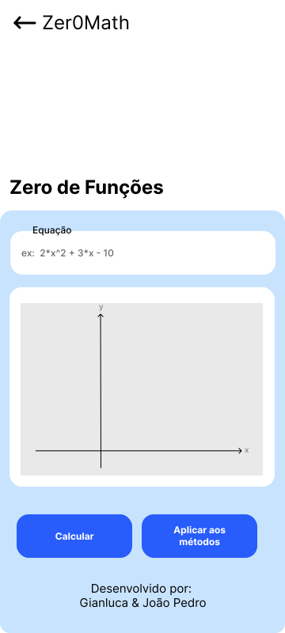
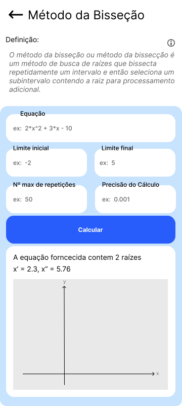

# Zer0Math

Um aplicativo matemático para exemplificar as equações dos zeros de funções

## First things First
Este é um projeto para conclusão de uma disciplina de Cálculo Numérico, com o intuito de exemplificação das equações matemáticas de cálculo de zero de e quações

## Instalação
Este é um projeto [Flutter](https://docs.flutter.dev/), se necessitar de ajuda sobre como programar em Flutter você poderá consultar a documentação para obter ajuda e tutoriais.

## Screenshots

| Página Inicial | Tela Gráfico |
| -------------- | ------------- |
|   |  |

| Tela Métodos | Tela Equações |
| ------------ | ------------- |
|  |  |

## Referências

[Método da bisseção](http://www.dma.uem.br/kit/calculo-numerico-2/kit-bisseccao.pdf)
