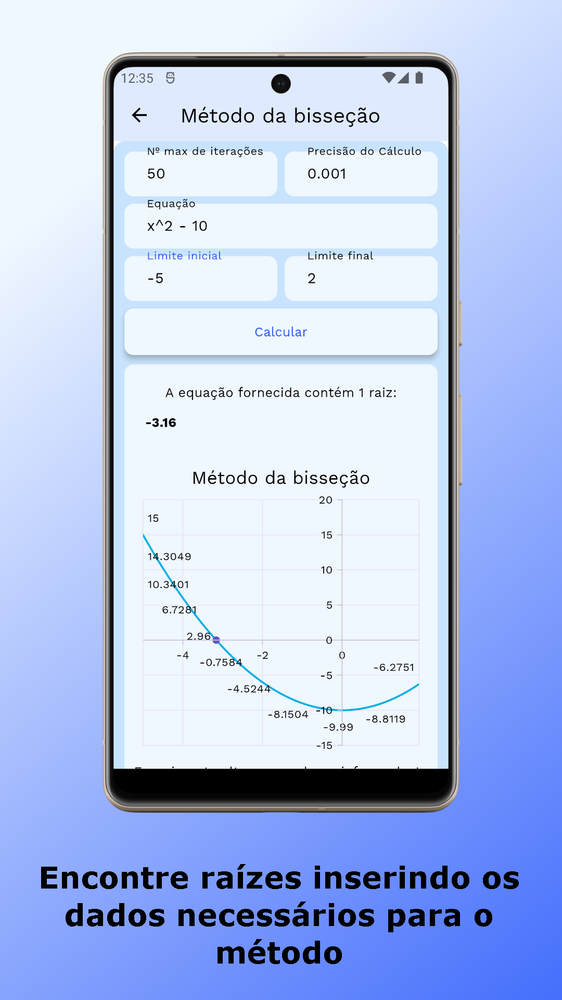

# Zer0Math

Um aplicativo matemático para exemplificar as equações dos Zeros de Funções

## First things First

Este é um projeto de um artigo científico [a ser publicado]()

Com o título `Desenvolvimento de um aplicativo para ensino de Zero de Funções`, este artigo traz uma abordagem sobre as dificuldades do ensino da matemática no ensino superior e traz uma solução tecnológica sobre a resolução desse problema.

Zer0Math é um aplicativo voltado para o ensino de Zero de Funções no percurso das disciplinas de Cálculo Numérico.

## Instalação

Este é um projeto [Flutter](https://docs.flutter.dev/), se necessitar de ajuda sobre como programar em Flutter você poderá consultar a documentação para obter ajuda e tutoriais.

## Screenshots

| Página Inicial                                           | Tela Gráfico                                            |
| -------------------------------------------------------- | ------------------------------------------------------- |
|  |  |

| Tela Métodos                                           | Tela Equações                                          |
| ------------------------------------------------------ | ------------------------------------------------------ |
|  |  |

## Licença

Este projeto está licenciado sob a licença [Creative Commons Attribution-NonCommercial-NoDerivatives 4.0 International (CC BY-NC-ND 4.0)](https://creativecommons.org/licenses/by-nc-nd/4.0/legalcode).

## Referências

[Método da bisseção](http://www.dma.uem.br/kit/calculo-numerico-2/kit-bisseccao.pdf)
